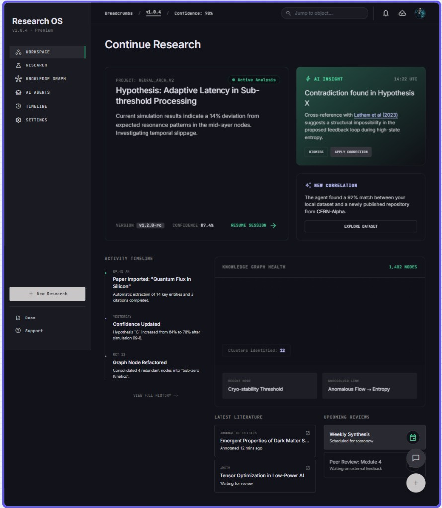

# Workspace UI concept

The workspace **mimics a VS Code window**: three columns, a collapsible bottom tools strip, editor tabs in the center. Thinking happens in the graph and the transcript, not on a project-management dashboard.

Older sketch (regions only; ignore garbled labels):



That mockup is **not** the layout. Do not ship node-count heroes, “graph health,” or a floating chat bubble as the shell. The reference is the IDE: explorer | editor + panel | secondary sidebar.

## Shell (VS Code analogue)

```text
┌─ App title bar (fixed)  Workspace · persona · version     🔍 Search (top right) ─┐
│ LEFT DRAWER          │ CENTER                        │ RIGHT DRAWER             │
│ ┌ header (fixed) ──┐ │ Tabs: Graph | H-017 | Doc…    │ ┌ header (fixed) ──────┐ │
│ │ workspace · «    │ │                               │ │ Chat · Explore · «   │ │
│ ├ body (scroll) ───┤ │  GRAPH or document tab        │ ├ body (scroll) ───────┤ │
│ │ ▾ Objects        │ │                               │ │ 14:02 You            │ │
│ │ ▾ Documents      │ ├─ Bottom panel (collapsible) ──┤ │ 14:02 Ideate         │ │
│ │ ▾ Branches       │ │ Timeline | Review | Jobs | …  │ │ …                    │ │
│ ├ footer (fixed) ──┤ │                               │ ├ footer (fixed) ──────┤ │
│ │ Settings · + New │ │                               │ │ composer / actions   │ │
│ └──────────────────┘ │                               │ └──────────────────────┘ │
└──────────────────────┴───────────────────────────────┴──────────────────────────┘
```

Left and right are **collapsible drawers** (not undocked windows). Each drawer is a column with a **fixed header**, a **scrolling body**, and a **fixed footer**. Header and footer never scroll away. Collapse leaves a narrow icon rail (or a chevron on the center edge) so the graph can use the width. Drawers do not cover the **app title bar** or the **bottom tools** strip.

| IDE region | Ideate |
| --- | --- |
| Activity bar + explorer | **Left drawer** — tree (Objects, Documents, Branches). |
| Editor group | **Center** — Graph tab; object pages; **document tabs**. |
| Panel (Terminal) | **Bottom tools** — Timeline, Review, Jobs, Problems. |
| Secondary sidebar | **Right drawer** — Chat (and Insights / Inspector / Outline). |
| Title bar search | **Global Search**, top right — not a left-nav item. |

The page is the graph. Chat is an input method (Explore), persisted in full. Agents stay off the top-level nav.

## Drawers (left and right)

Implement both sides as the same **drawer** primitive (Angular: overlay-free side column, or CDK/Material drawer in `side` mode — not a modal).

| Slot | Behavior |
| --- | --- |
| **Header** | Position sticky / flex-none. Title, collapse control, context (workspace on the left; Chat / Insights / Inspector / Outline + mode on the right). Never scrolls. |
| **Body** | `overflow-y: auto`. This is the only scrolling region in the drawer. Tree (left) or message list / insight list (right). |
| **Footer** | Flex-none, pinned to the **bottom of the drawer**. Actions that must stay visible (Settings, + New; Chat composer). Never scrolls under the body. |

Collapsed: width → icon rail (~48px). Header/footer still exist as icon-only (collapse/expand, Chat vs Insights). The center editor grows. Persist open/closed + width per account.

Independent: collapsing left does not close right, and the reverse.

## Left drawer (collapsible tree)

The drawer **body** is an **explorer tree** (VS Code folder view), not a flat icon list of destinations. Roots expand and collapse. The user creates and renames folders where that root allows it (Documents always; Objects may group by type automatically).

**Search is not a row here.**

| Slot | Content |
| --- | --- |
| **Header (fixed)** | Current workspace name / switcher. Collapse «. Optional filter on the tree (local, not Global Search). |
| **Body (scroll)** | The tree below. |
| **Footer (fixed)** | Settings. **+ New** (Thought in this project, or new workspace: name + required persona). |

```text
▾ Objects                            ← body only; workspace name is the header
    ▾ Hypothesis
        H-017 Adaptive latency
    ▾ Evidence
        E-43 Lease economics
▾ Documents                          ← this engagement only; user folders
    ▾ Client data
        margins.xlsx  → SharePoint
    ▾ Interviews
        store-visits.docx
▾ Branches
    Mainstream
    Overlay: challenge
```

| Root | Tree of | Click / open |
| --- | --- | --- |
| **Objects** | Cards (auto-grouped by type; optional user folders later). | Single-click: focus camera on the graph. Double-click / Enter: [full object page](#full-object-page) tab. |
| **Documents** | User-built folders + items. Items are usually **links** to SharePoint / OneDrive / a DMS (or a stored file). Engagement-scoped. | If the user **may access** it: open a **document tab** in the center. If not: omit from the tree or show locked — never open. |
| **Branches** | Mainstream and overlays. | Switch branch / show overlay. |
| **Settings** | Opened from the **footer**, not as a deep tree. | Persona, LLM provider (cloud or Ollama / LM Studio / URL), evidence policy, privacy. |

Workspace switcher is the **drawer header**. **+ New workspace** is the **drawer footer**. After signup: zero workspaces.

Avoid a top-level **AI Agents** item. Modes live on the Chat header or a small center toolbar.

### Documents (engagement collection)

This is the **user-organized file set for this workspace**, not a firm-wide KM product and not a Zotero clone. SharePoint (or peer) stays the system of record for the bytes; Ideate stores **structure + links + access**.

- User creates / renames / moves **folders** and items in this engagement only.
- An item is typically a **URL** (SharePoint, Teams, OneDrive, Google Drive, internal DMS) plus display name, optional note, and ACL. Upload to Ideate’s object store is optional later — still workspace-scoped.
- **Open as a center tab** (like a VS Code file): preview when we can; otherwise metadata + “Open in SharePoint.” Same editor group as Graph and object pages.
- **Access:** tree and tabs respect the user’s rights (SSO / matter ACL). A link the user cannot open does not appear as an unlocked tab. Client A’s tree never lists Client B.
- Connecting to the graph is explicit: **Attach to card** (usually Evidence). Literature on a node stays [attachment, not a second library](./object-model.md#literature-is-attachment-not-a-library). Documents is how the team *finds* engagement files; the graph is how those files *mean* something.

Not a SharePoint replacement. Not the home screen.

## Global Search (header, top right)

Command field in the **app title bar, top right** — the IDE search box, not a left-nav item.

It searches this workspace (and later, permissioned firm memory) in one place:

- Objects (`H-18`, `why Pi Zero`, `200 ANSI lumens`) → jump camera and/or open the object tab
- Documents (name, folder, link title) → open document tab if allowed
- Optional: transcript hits

Keyboard: `Ctrl/Cmd+P` / `Ctrl/Cmd+Shift+F` as in VS Code is the target. Results never leak items the user cannot access.

## Center: graph + editor tabs

The middle column is an **editor group**, not a dashboard.

- Default tab: **Graph** — zoomable, pannable [ngDiagram](https://www.ngdiagram.dev/) canvas.
- Selecting a card highlights it. **Click / Enter** opens a new tab with the [full object page](#full-object-page) (does not destroy the Graph tab).
- Opening a **Document** tree item opens another tab (preview or source launch), subject to ACL.
- Global Search (header) pans the Graph tab and/or focuses an existing object or document tab.
- User and AI may edit the graph while Chat is running.

### Graph cards (nodes)

Each node is a **card** with three bands. One Angular component per object type. Relationships are **edges**, not cards.

```text
┌─ HEADER ──────────────────────────────────────────────┐
│ [cat] H-017 · Hypothesis ▾ · v1.2          [+ ▾] [⋯] │
│ Adaptive latency in subthreshold processing           │
├─ BODY ────────────────────────────────────────────────┤
│ Two to four sentences. The claim or gist.             │
├─ FOOTER ──────────────────────────────────────────────┤
│ [estimate] [thermal]   💬 14:02 question + reply      │
└───────────────────────────────────────────────────────┘
```

| Band | Content |
| --- | --- |
| **Header** | Category color/symbol, display id, **type (editable)**, title, version, and a **manual actions** menu. See [Header actions](#header-actions). |
| **Body** | A **short** summary (a few sentences) — stored `summary`. |
| **Footer** | Tag chips. **Chat ref** to the user question + AI reply ([object-model.md](./object-model.md#chat-references)). **Paperclip** to attach files (images, PDF, DOCX, text) to this card. |

Click on the body (or title) → [full object page](#full-object-page). Header controls use `stopPropagation` so they do not open the page. Click an edge → highlight endpoints; no third card.

### Header actions

The header is how the user **overrides the AI** without Chat. Same menu on the compact card and the full-page header.

| Control | Does |
| --- | --- |
| **Type ▾** | Manually set object type (Hypothesis → Concept, Thought → Question, …). Opaque id stays. Display prefix may follow the type (`H-017` → `C-017`). Illegal promotions stay blocked (no Theory before Evaluation). Writes a version; chat refs stay empty on a pure manual edit unless they also typed in Chat. |
| **+ New node** | Mint a **new card** from this one. User picks type + optional title. New opaque id. `derived_from` / a typed edge back to the source. Place it on the canvas near the parent. |
| **+ New branch** | Create a branch **from this card** (required **Mainstream \| Overlay** dropdown). Overlay must name Mainstream as parent. See [object-model.md](./object-model.md#mainstream-vs-overlay-branches). |
| **⋯** | New version, change `object_category`, rename, attach, abandon, delete, Open in Chat, copy id. |

Personas only change which items sit on the visible **+** vs behind **⋯**. They do not hide type change or new node.

Click → [full object page](#full-object-page). Click an edge → highlight the two endpoint cards; no third card.

### Full object page

A complete reading surface (editor tab or route `/workspaces/:id/objects/:id`):

- Header: same identity chrome and **[header actions](#header-actions)** (type, new node, new branch, ⋯).
- **Main:** the **elaborate body** — the full persisted AI idea text (and later user edits). Not a teaser. The body may include one Mermaid fence, rendered on this tab.
- **References:** the **user message** and the **assistant message** for this version (timestamps, excerpts, jump into the Chat rail). Required for AI-generated versions. See [Chat references](./object-model.md#chat-references).
- **Attachments:** files hung on this card (preview / download / remove). Not the Documents tree.
- Provenance: `generated_by`, attachments, edges.

The transcript still holds *what was said*. The object page holds *the idea as materialized*. If the user edited the graph, HEAD may differ from the original model text; show a diff.

Closing the tab returns to Graph. The card on the canvas still shows only the short summary.

## Bottom panel (collapsible)

Same role as VS Code **Terminal / Problems**: tools that support the graph, not a second home.

| Tab | Purpose |
| --- | --- |
| Timeline | Object events (paper attached, H-18 revised, assumption removed). Evolution zoom vs activity zoom. |
| Review | Gaps, contradictions, publication / exam / decision — list of object ids. |
| Jobs | `SIMPLE` / `NORMAL` / `DEEP` / `BATCH` status ([java-backend-ai.md](./java-backend-ai.md)). |
| Problems | Contradictions and failed tool writes. Click jumps to the card. |

Collapsed: a thin bar (status + last job). Expanded: steals height from the canvas, never the left/right rails unless the window is tiny.

Do not put Chat here. Chat is the **right drawer**.

## Right drawer (collapsible)

Same drawer primitive as the left: **fixed header**, **scrolling body**, **fixed footer**. Vertical items (Chat, Insights, Inspector, Outline) live in the header (tabs or a compact switcher). Exactly one body is shown. Collapse the drawer to an icon rail.

| Item | Body (scroll) | Footer (fixed) |
| --- | --- | --- |
| **Chat** | Timestamped turns, oldest → newest. Click a message → cards it created. File chips under messages that have attachments. | **Composer** (mode + paperclip + message + Send). Never scrolls off. |
| Insights | Graph events only (contradiction, new link, listed object ids). | Dismiss / apply selected event. |
| Inspector | Fields of the selected card (peek), plus attachments on this card. | Attach / change type shortcuts. Full essay remains the object **tab**. |
| Outline | Mini structure of the graph / current page. | — |

Chat (required):

```text
┌ header (fixed)  Chat · Explore · Terra · « ─┐
│ body (scroll)                                 │
│ 14:02  You                                    │
│        Can the optical engine fit?            │
│ 14:02  Ideate                                 │
│        Created H-017, C-041…                  │
├ footer (fixed) ───────────────────────────────┤
│ [ Mode ▾ ]  Message…              📎   Send  │
└───────────────────────────────────────────────┘
```

The composer paperclip uploads files to Ideate’s local workspace store, then the turn sends their ids. Bytes stay on disk; the model receives **capped text extracts** (and images only if the provider is multimodal). Documents in the left tree remain SharePoint-class **URL links**.

Sending a turn materializes cards. Each card stores **this user message + this assistant message**. From a card, **Open in Chat** scrolls the **body** to both sides of that turn; the footer composer stays put.

Do not use a floating chat button as the primary conversation UI.

## What stays from the old concept

Keep the *product* rules; they attach to this chrome.

- **Global Search** top right (objects + documents the user can see).
- Insights are **graph events**, persona-weighted.
- Timeline rows are **object events**, not a social feed.
- Confidence belongs to an **object**. No header “98%.”
- Persona changes language and default Insight/Review weight, not the three-pane grid.
- Resume = same workspace + graph + transcript. Closing the browser does not end the investigation.

Home is not a separate dashboard. “Continue the idea” = last Graph camera + Chat scroll position + last open object tabs.

| Persona | Graph focus / Chat default |
| --- | --- |
| Student | Concept or misconception; Learn / Challenge |
| Researcher | Live hypothesis or theory version; Research / Review |
| Inventor | Binding constraint or architecture version; Challenge / Create |

Inventory counts belong in Outline or Objects tree — not a hero widget.

## First Angular surfaces (when we scaffold)

1. Angular 22 **PWA** three-pane shell: **left and right collapsible drawers** (fixed header + footer, scrolling body), editor tabs, collapsible bottom. Desktop/tablet; not a phone authoring layout.
2. Graph tab: ngDiagram, one card component per type (header / summary body / footer tags), zoom/pan.
3. Click card → object tab with **full AI body**.
4. Chat: timestamped transcript + bottom composer; turns persist; objects appear on the graph.
5. Header Search (objects + permitted documents).
6. Documents tree + ACL’d document tabs.
7. Bottom Timeline + Problems; Insights rail.

No component work until the v0 object list is frozen. Layout is decided: **IDE, not dashboard.**
